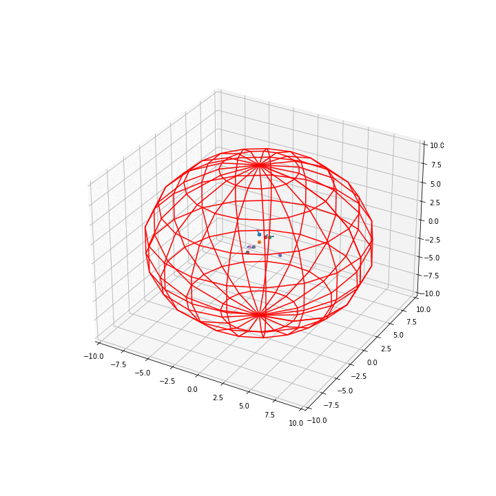
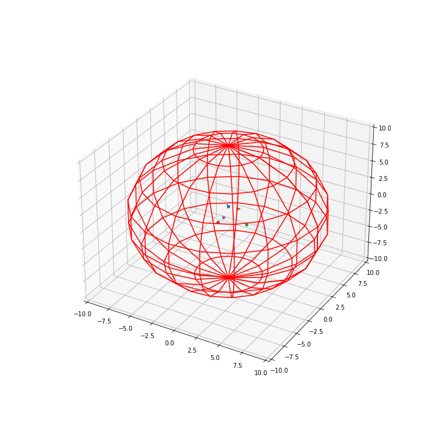

### N-charged-particles-in-a-sphere-with-mplot3d
# Algorithm
> In the file "N charged particles in a sphere - clean" is the core code, with comments explaining each step, the algorithm will create N files .png from mplot3d that you can use to make a gif.
# Quick explanation.
>The interaction of the particles will be described from the electric forces, we use Coulomb's law. Where the resultant force on a particle is the sum of each force acting on it by the interaction of the other particles in the system. From this, given the initial conditions of each particle we can define where it is going using Newtonian mechanics.
# Examples gifs:

